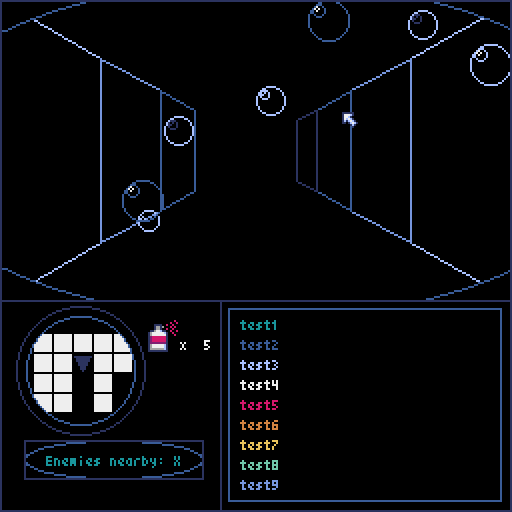
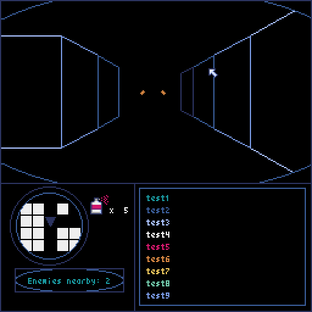
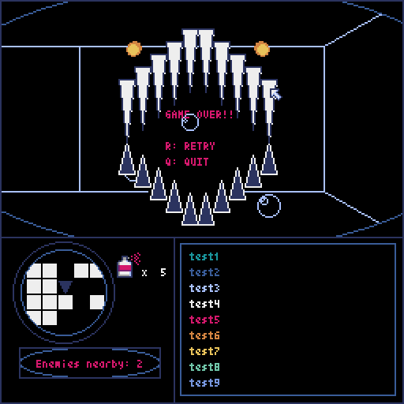
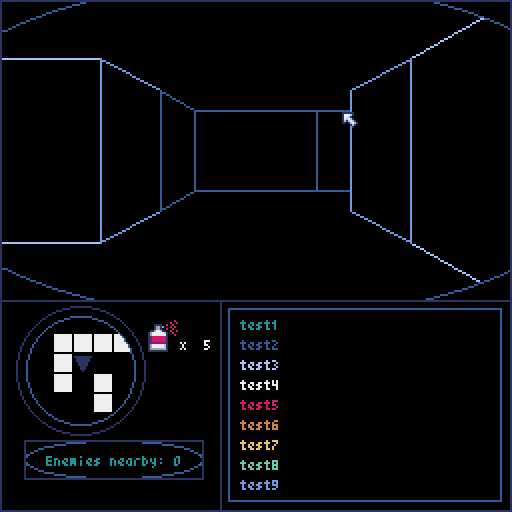

# pyxel_maze 

pythonのレトロゲームエンジン"pyxel"で作成した迷路ゲームです。 
This is a maze game created with the python retro game engine "pyxel". 
 
 

プレイヤーは深海のダンジョンをイメージした迷路を探索します。 
The player explores a maze that resembles a deep-sea dungeon. 
 
 

迷路には敵キャラクターや様々なギミックを作成する予定です。 
I plan to create enemy characters and various gimmicks in the maze. 
 
 

現在開発中です。迷路の中を歩きまわることができるところまでは進みました。 
It is currently under development. 
I have progressed to the point where you can walk around in the maze. 
 
 

作者はWindows10、Windows11で開発を行っており、そのほかの環境での動作確認はしていません。 
I am developing on Windows 10 and Windows 11, and I have not tested the game on other environments. 
 

遊んでくれたらうれしいです。 
ご覧いただきありがとうございます。 
I'd be happy if you could play with it. 
Thank you for reading. 
